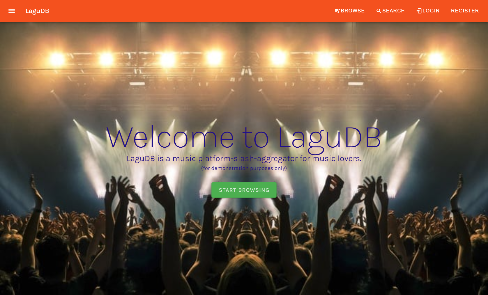
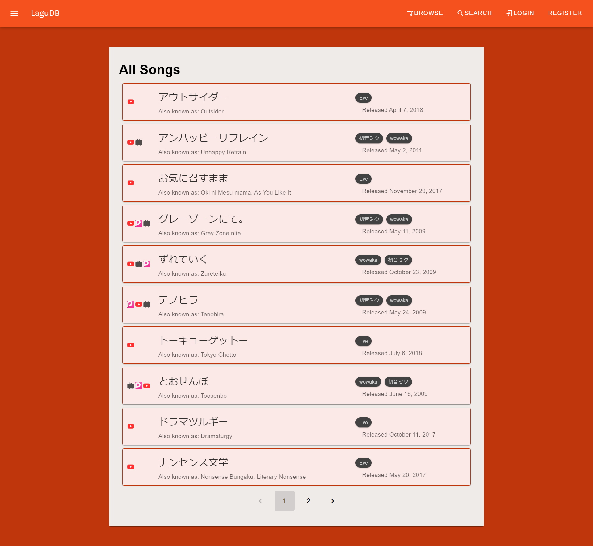
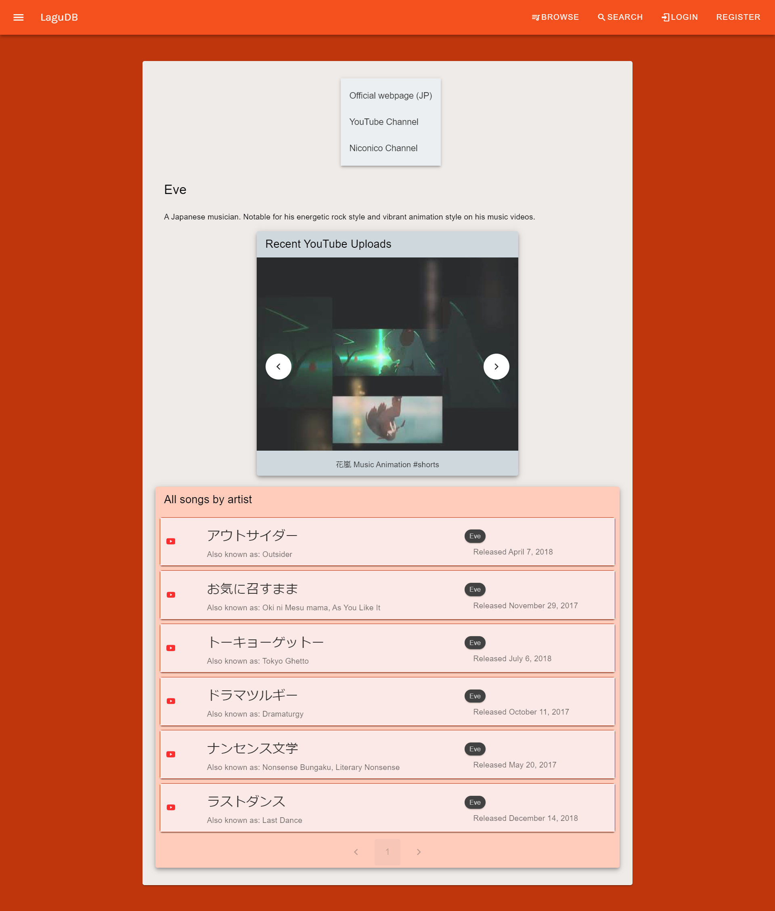

# LaguDB - Server

Lagu - Indonesian for "song".

Modelled after Last.fm, Discogs, and VocaDB, LaguDB is an aggregate platform for musical artists, songs, albums, and the like. With LaguDB you can follow your favourite artists and keep updated on their latest songs. In addition, LaguDB also has a novel feature - auto-timed lyrics, or lyrics that play along with the music video in real time. 

*This is a proof of concept expanding upon the [LaguDB Rest API](https://github.com/ValYauw/lagu-db-server), showcasing the basic Read features and the auto-timed lyrics features. Presently this project is undergoing a UI re-design and is pending further development. Thank you for your patience.* 

Back-end: [Link](https://github.com/ValYauw/lagu-db-server)

## Application Demo

### Basic UI

### Browse Songs and Artists

### MVP - Lyrics change alongside the music

## Features

 - Google Login (OAuth) *(presently no web features are locked behind login)*
 - Browse songs, albums, artists
 - Web UI made using the Vue.js framework and the Vuetify UI Library
 - State management using Pinia
 - Integration with Third Party APIs (YouTube Data and VocaDB public API)
 - Integration with the YouTube IFrame API on the front-end to render auto-timed lyrics

## How to setup

Add the `.env` file to set up the API URL and the Google Client ID (for login).

Run `npm run dev` to start the application.